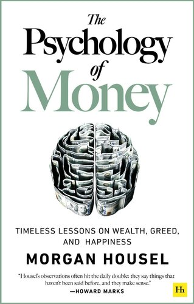

在不到 200 页的篇幅中，摩根豪塞尔成功地通过几篇关于金钱和企业管理的短篇小说提供了经验教训。 本书使用通俗易懂的英语，易于阅读和理解。 他揭露了商业世界中的许多神话和虚假假设，尤其是运气与天赋的两难选择。

内容简介

看穿投資與理財的本質，改進理財的缺陷、偏見與不良行為

人人都能邁向財務自由的人生

世界上有賺很多錢卻破產的人，也有賺很少錢卻有辦法捐大錢做慈善的人。為什麼？

因為理財結果與運氣和風險有關，而且不受才智與個人努力影響，更重要的是，與其了解許多理財專業知識，適當的言行舉止更加關鍵。

這就是致富心態，這是現今社會不可或缺的軟實力。

《華爾街日報》知名專欄作家摩根‧豪瑟發覺，我們是用理解知識的方式在思考、學習金錢觀，而不是用理解心智與行為模式的方式在學習投資與理財。不過，我們的理財行為卻深受各種情緒的影響。每個人看待世界運作的方式各不相同，所以看待金錢運作的觀點天差地別，結果是有人成為富翁，有人卻窮困潦倒。

在《致富心態》中，摩根‧豪瑟分享許多短篇的理財故事，探討人們思考金錢的方式，並傳授致富的技巧，你會學到：

．巴菲特成為億萬富翁的真正理由

．致富與守財是兩種不同的技巧，但都非常重要。

．有許多事情不管潛在獲利有多龐大，都不值得冒險。

．了解長尾效應與複利效果的本質與威力。

．掌控你的時間，就是金錢付給你最高的紅利。

．預留安全邊際的重要性。

．財富自由真正的本質。

就算你是零經驗的理財新手，也可以輕鬆學會一生受用的致富觀念與技巧；如果你已經理財有成，更能進一步突破盲點、強化策略，讓你不只賺更多，還可以永遠保有財富，一輩子過著生活無虞的快樂人生。

    目录
    
    前言：地表上最精采的表演
    1 沒有人真的是瘋子
    2 運氣與風險
    3 貪得無厭
    4 讓人混淆的複利
    5 致富與守財
    6 長尾效應
    7 自由
    8 超跑車主的謬論
    9 財富其實是你看不到的資產
    10 存錢
    11 合理勝過理性
    12 意外！
    13 預留犯錯空間
    14 你會改變
    15 天下沒有白吃的午餐
    16 你和我
    17 悲觀主義的魅力
    18 當你相信任何事情
    19 觀點匯總
    20 我的自白
    後記：美國消費者的養成之路

贴一个[读书笔记](https://greenhornfinancefootnote.blogspot.com/2021/01/the-psychology-of-money.html)

